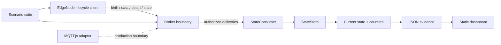

# Architecture

## Goals

The lab makes edge-state failure behavior observable and reproducible. Its core goals are to keep
the state model independent of an MQTT library, fail closed on malformed or unauthorized input,
bound every application-owned buffer, and produce evidence a reviewer can rerun with one command.

## Component boundaries

### Core

`src/core` has no broker dependency. It owns the public message contract, topic grammar,
authorization decisions, sequence arithmetic, bounded queue, and current-state reconstruction.
This layer is deterministic and receives time as data rather than reading the wall clock.

### Lab

`src/lab` implements only the broker behaviors the scenarios need: authentication, scoped ACLs,
retained messages, subscriptions, wills, duplicate replay, and restart. It deliberately does not
parse MQTT packets or claim protocol conformance. The edge node queues metric batches, not encoded
envelopes, so reconnect can assign a fresh birth sequence and source context before flushing.

### External adapter

`src/mqtt` is a narrow MQTT.js publisher. It enables MQTT 5, uses QoS 1, sets a finite receive
maximum and session expiry, and disables MQTT.js's implicit QoS 0 offline queue. Credentials are
loaded from the environment and excluded from the public diagnostic view.

### Reporting and dashboard

The scenario suite returns a stable `LabReport`. The CLI serializes it both as a CI artifact and as
the dashboard input. The browser code creates DOM nodes and assigns `textContent`; it does not inject
report strings as HTML.

## State flow

1. The node increments `birthSequence`, resets `seq`, registers retained offline state as its will,
   publishes birth, then publishes a retained online snapshot.
2. Data increments the unsigned 8-bit sequence, updates the node's current metric map, publishes a
   non-retained event, and replaces the retained state snapshot.
3. The consumer validates topic and payload identity before using the message ID or sequence.
4. An exact message-ID repeat is counted and ignored. A distinct old sequence is recorded without
   rolling current state backward. A forward gap is applied and its missing count is recorded.
5. An unexpected disconnect replaces retained state with the broker-published offline will. A
   reconnect publishes a new birth before flushing bounded offline metric batches.

## Failure containment

- Runtime schemas reject unknown fields, unsafe integer values, invalid timestamps, and inconsistent
  lifecycle flags.
- Topic parsing rejects wildcards and noncanonical paths on the publish side.
- The dedupe map is capped and evicts oldest IDs.
- The outbox requires a positive capacity and exposes every drop or rejection.
- Authorization is deny-by-default; consumers cannot publish and nodes cannot create group-wide
  subscriptions.
- Old messages remain observable in statistics but cannot overwrite the latest state.

## Trade-offs

The store merges metrics by name for O(m) processing per envelope. A persistent implementation
would likely shard state by group/node, persist dedupe windows, and expose tombstone/expiry policy.
The test broker stores credentials as plain strings only because it is an in-process test double;
the optional real broker profile and deployment guidance keep authentication concerns separate.
